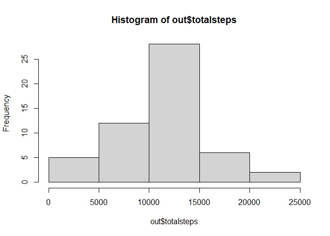
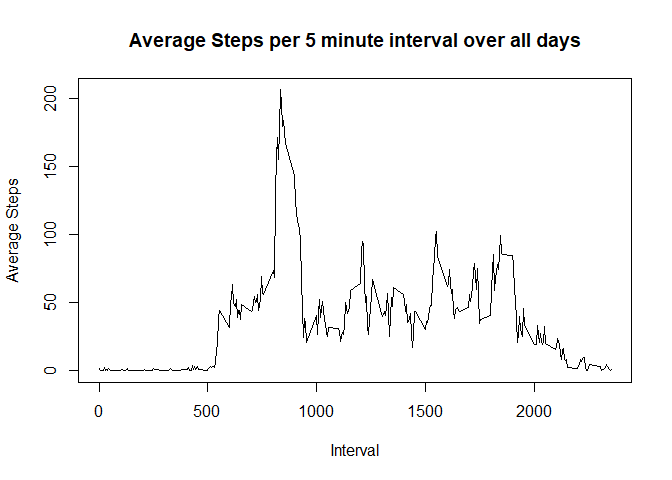
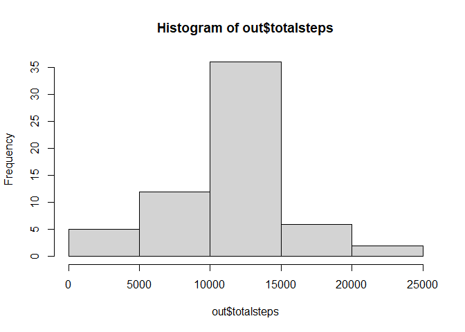
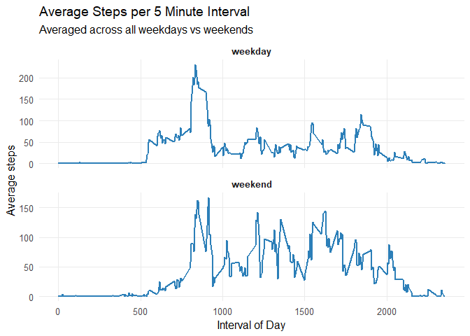

## Loading and preprocessing the data

``` r
data <- read.csv("activity.csv", header = TRUE)
summary(data)
```

```
##      steps            date              interval     
##  Min.   :  0.00   Length:17568       Min.   :   0.0  
##  1st Qu.:  0.00   Class :character   1st Qu.: 588.8  
##  Median :  0.00   Mode  :character   Median :1177.5  
##  Mean   : 37.38                      Mean   :1177.5  
##  3rd Qu.: 12.00                      3rd Qu.:1766.2  
##  Max.   :806.00                      Max.   :2355.0  
##  NA's   :2304
```

## What is mean total number of steps taken per day?

``` r
data[[2]] <- as.Date(data[[2]])
out <- aggregate(data[[1]] ~ data[[2]], data = data, FUN = sum, na.rm = TRUE)
names(out) <- c("date", "totalsteps")
hist(out$totalsteps)
```

<!-- -->

``` r
mean(out$totalsteps, na.rm = TRUE)
```

```
## [1] 10766.19
```

``` r
median(out$totalsteps, na.rm = TRUE)
```

```
## [1] 10765
```


## What is the average daily activity pattern?

``` r
out <- aggregate(data[[1]] ~ data[[3]], data = data, FUN = mean, na.rm = TRUE)
names(out) <- c("interval", "averagesteps")
plot(out$interval, out$averagesteps, type = "l", xlab = "Interval", ylab = "Average Steps", main = "Average Steps per 5 minute interval over all days")
```

<!-- -->

``` r
i_max <- which.max(out$averagesteps)
out[[1]][i_max]
```

```
## [1] 835
```


## Imputing missing values
### My strategy is to fill in the missing values with the average of that invterval over all days

``` r
sum(is.na(data))
```

```
## [1] 2304
```

``` r
library(dplyr)
```

```
## 
## Attaching package: 'dplyr'
```

```
## The following objects are masked from 'package:stats':
## 
##     filter, lag
```

```
## The following objects are masked from 'package:base':
## 
##     intersect, setdiff, setequal, union
```

``` r
#Ensure proper types
data <- data %>% mutate(steps = as.numeric(steps), interval = as.integer(interval))

# Interval average across all days (ignoring NAs)
interval_avg <- data %>% group_by(interval) %>% summarise(avg_steps = mean(steps, na.rm = TRUE), .groups = "drop")

#find days with NA values
days_all_NA <- data %>% group_by(date) %>% summarise(all_na = all(is.na(steps)), .group = "drop") %>% filter(all_na) %>% pull(date)

#Fill NA values with mean of that interval over all days
data_filled <- data %>% left_join(interval_avg, by = "interval") %>% mutate(steps = ifelse(date %in% days_all_NA & is.na(steps), avg_steps, steps)) %>% select(-avg_steps)

#Plotting the histogram of new data set with missing values filled in
out <- aggregate(data_filled[[1]] ~ data_filled[[2]], data = data_filled, FUN = sum, na.rm = TRUE)
names(out) <- c("date", "totalsteps")
hist(out$totalsteps)
```

<!-- -->

``` r
mean(out$totalsteps, na.rm = TRUE)
```

```
## [1] 10766.19
```

``` r
median(out$totalsteps, na.rm = TRUE)
```

```
## [1] 10766.19
```


## Are there differences in activity patterns between weekdays and weekends?

``` r
library(dplyr)

# Create factor variable for weekday/weekend
data_filled$day_type <- factor(
  ifelse(as.integer(format(data_filled$date, "%u")) >= 6, "weekend", "weekday"),
  levels = c("weekday", "weekend")
)

#Average the number of steps per interval for weekdays and weekends

library(ggplot2)

avg_by_interval <- data_filled %>%
  group_by(day_type, interval) %>%
  summarise(avg_steps = mean(steps, na.rm = TRUE), .groups = "drop")

#Draw the Panel time series Plot for weekday and weekends for each interval and steps taken

ggplot(avg_by_interval, aes(x = interval, y = avg_steps)) +
  geom_line(color = "#2C7FB8", linewidth = 0.9) +
  facet_wrap(~ day_type, ncol = 1, scales = "free_y") +  # two panels, one over the other
  labs(
    title = "Average Steps per 5 Minute Interval",
    subtitle = "Averaged across all weekdays vs weekends",
    x = "Interval of Day",
    y = "Average steps"
  ) +
  theme_minimal(base_size = 12) +
  theme(
    panel.grid.minor = element_blank(),
    strip.text = element_text(face = "bold")
  )
```

<!-- -->
